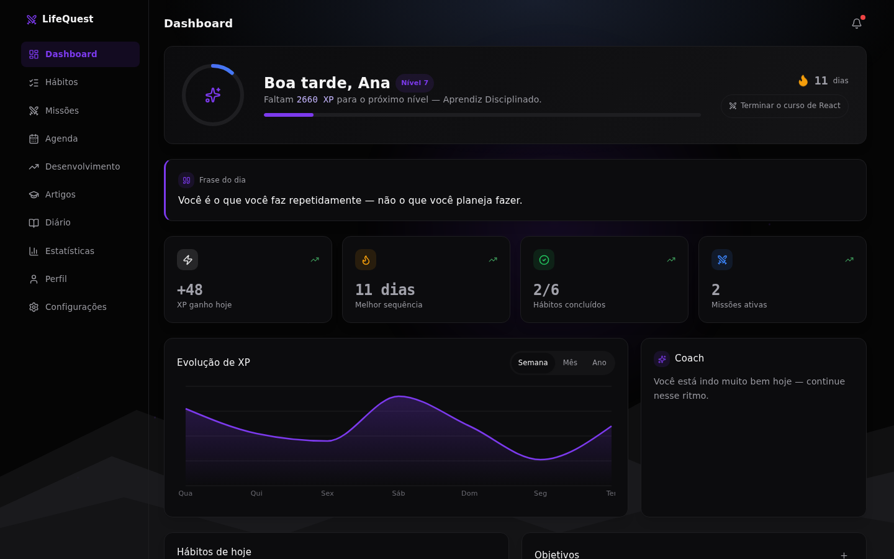
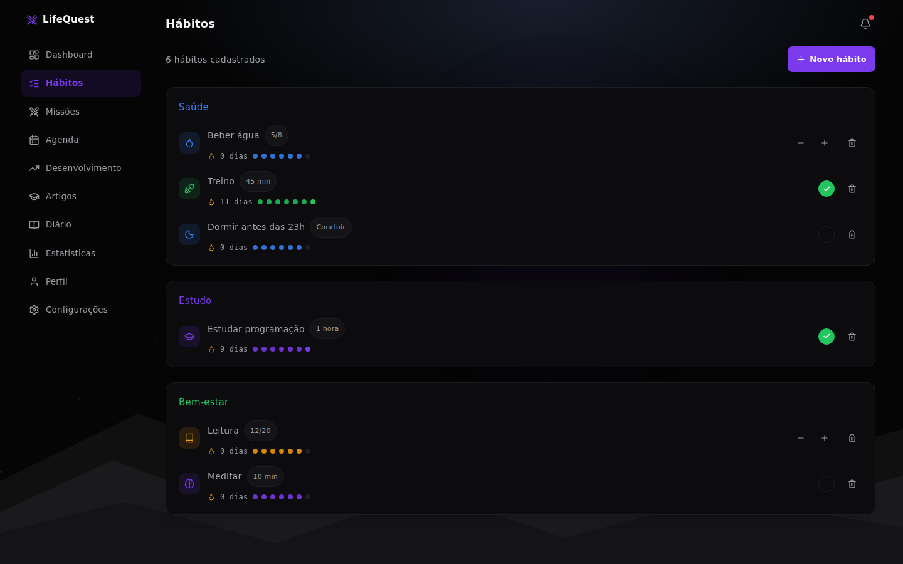
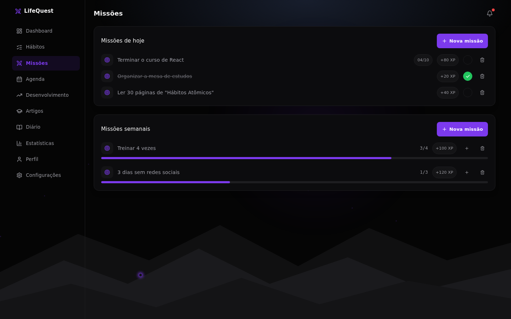
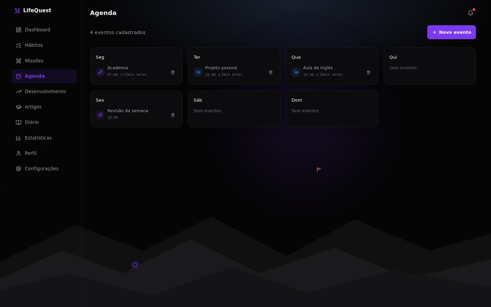
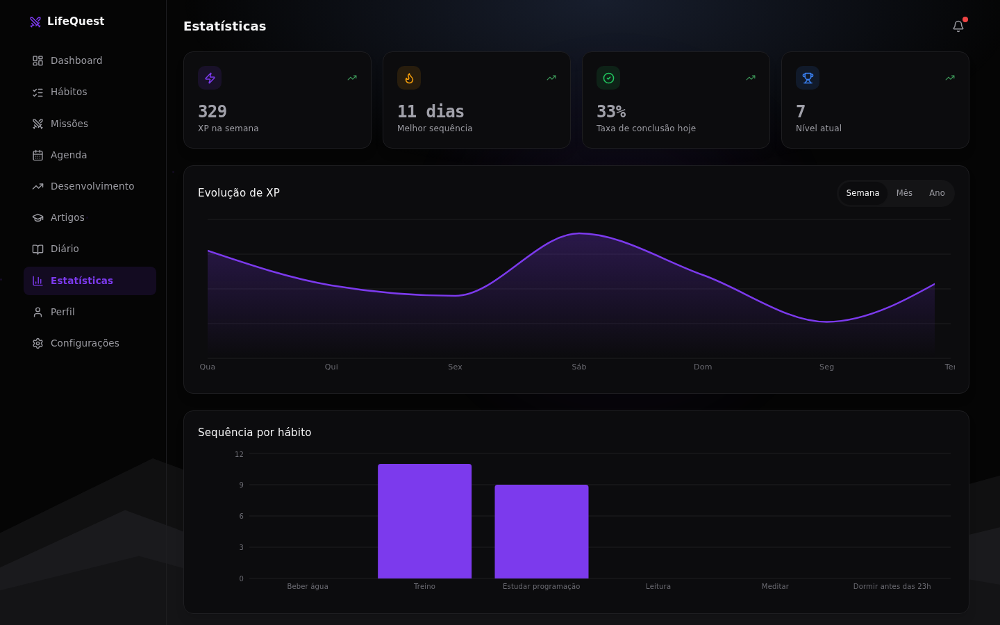
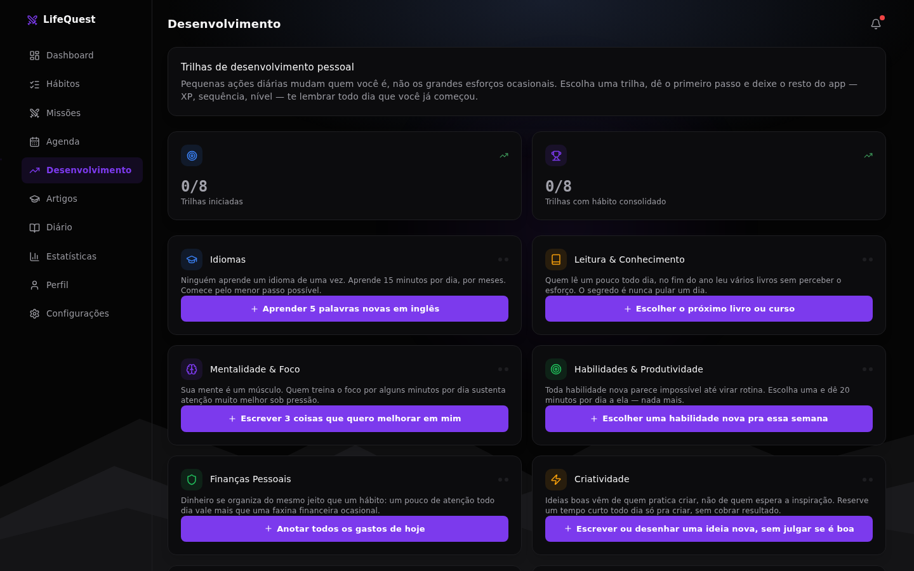
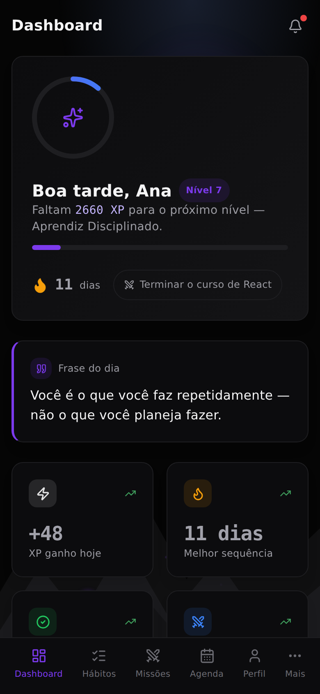

# LifeQuest — Hábitos, missões e disciplina como um jogo

[](https://github.com/Mhsilva-dev/lifequest/actions/workflows/ci.yml)

Aplicação web que transforma a rotina em um RPG: hábitos e missões concluídos dão XP, o XP sobe o nível, e sequências de dias seguidos mantêm a disciplina visível. Tem agenda com alarme, diário, estatísticas e notificações push que chegam mesmo com o app fechado. Funciona no computador e instala no celular como aplicativo (PWA).

**🔗 Sistema em produção:** [lifequest.mhsilvadev.com.br](https://lifequest.mhsilvadev.com.br)

> O sistema está no ar e aberto para cadastro. Cada conta é isolada e começa zerada.


<p align="center">
  
</p>

## Telas

| Página inicial | Hábitos |
|---|---|
|  |  |

| Missões | Agenda |
|---|---|
|  |  |

| Estatísticas | Desenvolvimento |
|---|---|
|  |  |

<p align="center">
  
</p>

> Os dados que aparecem nas imagens são fictícios.

## Funcionalidades

**Progressão**
- XP por hábito e missão concluídos, níveis e títulos (ranks) conforme a evolução
- Sequência de dias seguidos por hábito, com marcos em 7, 14, 30, 60, 100, 200 e 365 dias
- Gráfico de evolução de XP por semana, mês e ano

**Hábitos e missões**
- Hábitos do tipo "concluir" ou com contagem (ex.: 8 copos de água), por categoria, ícone e cor
- Missões do dia com prazo e missões semanais com progresso
- Objetivos de longo prazo com porcentagem
- Trilhas de desenvolvimento que sugerem hábitos e missões em etapas

**Rotina**
- Agenda semanal (eventos recorrentes ou em data única) com alarme sonoro e botão de desligar
- Diário com humor do dia, o que foi feito e o que melhorar
- Artigos sobre disciplina, dopamina, finanças e livros
- Dicas do coach e frase do dia de acordo com o progresso

**Conta e app**
- Onboarding com um quiz de 5 perguntas que calcula o "Índice de Disciplina"
- Cadastro e login, progresso sincronizado entre dispositivos
- Funciona offline (agenda e alarme inclusive) e sincroniza quando a conexão volta
- Notificações push de eventos, hábitos pendentes e missões com prazo, mesmo com o app fechado
- Tema claro/escuro e cor de destaque
- Painel administrativo (somente leitura) com as contas cadastradas

## Destaques técnicos

- **Push no servidor, com anti-spam persistente.** Um agendador no backend varre a cada minuto os usuários inscritos e dispara Web Push (VAPID) no fuso horário de cada um. Uma tabela `notification_log` com chave primária `(usuário, tipo, item, dia)` garante no máximo um envio por gatilho por dia, mesmo que o processo reinicie.
- **Service worker próprio.** O PWA usa `injectManifest` com um `sw.js` escrito à mão para tratar o evento `push` e o clique na notificação, com `skipWaiting()` e `clients.claim()` para que atualizações cheguem a apps já instalados.
- **Offline first.** O estado da conta fica em cache local; o app abre e funciona sem internet e envia as alterações ao voltar a conexão.
- **Estado como documento.** Todo o progresso do jogador é um único JSON por conta (`game_state`), gravado com upsert. Simplifica a sincronização e deixa o schema do banco pequeno.
- **Segurança.** Senhas com bcrypt, sessão em cookie `httpOnly`/`sameSite`, `SESSION_SECRET` obrigatório em produção, CORS restrito às origens configuradas, login do admin com comparação em tempo constante e `Cache-Control: no-store` em todas as respostas da API, para que nenhum proxy ou cache de rede compartilhada sirva os dados de uma conta a outro dispositivo.
- **Áudio do alarme com Web Audio API**, sem arquivos de som: um `AudioContext` compartilhado e retomado antes de cada toque.

## Arquitetura

```
Navegador / PWA ──► Nginx (SSL) ──┬──► / ──────► front-end (React + Vite)
   ▲                              └──► /api/ ──► Node.js / Express ──► SQLite
   │                                                   │
   └──────────── Web Push (VAPID) ◄── agendador (1 min)┘
```

A documentação técnica fica em [`docs/`](docs/):

- [Arquitetura](docs/arquitetura.md)
- [Banco de dados](docs/banco-de-dados.md)
- [Notificações push](docs/notificacoes.md)
- [Referência da API](docs/api-referencia.md)

## Estrutura

```
src/                         front-end (React)
├── main.jsx                 entrada: app ou painel /admin
├── App.jsx                  sessão, onboarding x app
├── LifeQuest.jsx            telas, estado do jogo, XP e níveis
├── Onboarding.jsx           quiz inicial, cadastro e login
├── AdminPanel.jsx           painel administrativo
├── InstallPrompt.jsx        convite para instalar o PWA
├── pushNotifications.js     inscrição no Web Push
├── api.js                   cliente HTTP
├── sw.js                    service worker (precache + push)
└── *.css                    tokens de tema e estilos

backend/
└── src/
    ├── server.js            Express, sessão, CORS e rotas
    ├── db.js                schema SQLite
    ├── defaultState.js      estado inicial de uma conta
    ├── reminderScheduler.js agendador de notificações
    ├── webpush.js           configuração VAPID
    └── routes/              auth, state, push, admin
```

## Como rodar localmente

Requisitos: Node.js 20 ou superior.

```bash
git clone https://github.com/Mhsilva-dev/lifequest.git
cd lifequest

# back-end (porta 3007)
cd backend
npm install
cp .env.example .env
npm run dev

# front-end (porta 3006), em outro terminal
cd ..
npm install
npm run dev
```

Acesse `http://localhost:3006`. Em desenvolvimento o Vite repassa `/api` para o back-end, e o banco SQLite é criado automaticamente na primeira execução.

Opcionais: as chaves VAPID (`npx web-push generate-vapid-keys`) ativam as notificações push, e `ADMIN_USERNAME`/`ADMIN_PASSWORD` ativam o painel `/admin`. Sem elas o restante do app funciona normalmente.

## Deploy

Em produção, a aplicação roda em uma VPS Linux com **PM2** ([`backend/ecosystem.config.js`](backend/ecosystem.config.js)) e **Nginx** como proxy reverso com SSL do **Let's Encrypt**: `/` vai para o front-end compilado e `/api/` para o back-end. O repositório inclui um [`nginx.conf`](nginx.conf) de referência.

## Autor

Desenvolvido por **Matheus Henrique Fonseca Silva** — [GitHub](https://github.com/Mhsilva-dev) · [LinkedIn](https://www.linkedin.com/in/matheus-silva-01b8b3433)
