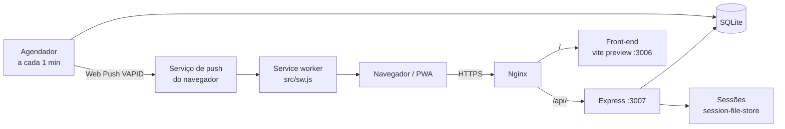
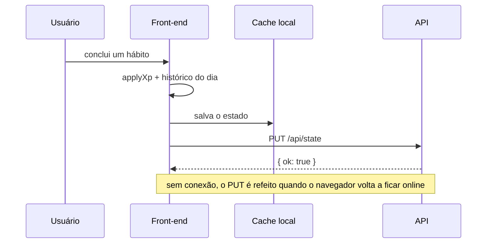

# Arquitetura

O LifeQuest é dividido em duas aplicações que rodam na mesma VPS, atrás do Nginx:

| Parte | Tecnologia | Porta | Função |
|---|---|---|---|
| Front-end | React 19 + Vite + Tailwind CSS | 3006 | SPA/PWA com todas as telas e a lógica do jogo |
| Back-end | Node.js + Express + SQLite | 3007 | Contas, sincronização do progresso e notificações push |

## Front-end

- `LifeQuest.jsx` concentra o estado do jogo (`useState`) e as telas: dashboard, hábitos, missões, agenda, desenvolvimento, artigos, diário, estatísticas, perfil e configurações.
- As regras de progressão (XP, nível, sequências, gráficos) são funções puras no topo do arquivo: `applyXp`, `computeStreak`, `computeWeek`, `buildChartData`.
- Toda alteração do estado é salva no servidor com `PUT /api/state` e também em cache local. Sem internet, o app abre a partir desse cache e reenvia o estado quando o evento `online` dispara.
- O alarme da agenda é tocado com a Web Audio API e exibido em uma sobreposição com botão para desligar.

## Back-end

- `server.js` configura CORS por lista de origens, sessão em cookie `httpOnly`/`sameSite=lax` (com `secure` em produção) e `Cache-Control: no-store` em todas as respostas.
- O estado do jogador é tratado como um documento JSON por conta; o servidor não conhece as regras do jogo, apenas guarda e devolve.
- `reminderScheduler.js` lê esse documento para decidir quais notificações enviar. Detalhes em [notificacoes.md](notificacoes.md).

## Fluxo de uma ação

