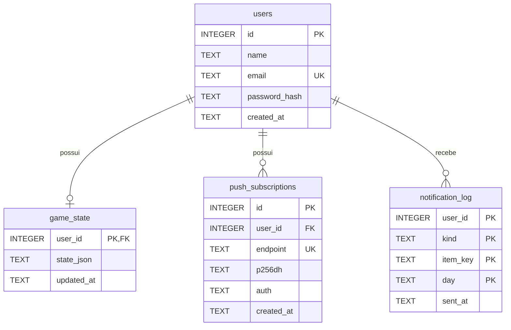

# Banco de dados

SQLite via `better-sqlite3`, em modo WAL e com chaves estrangeiras ativas. O schema é criado automaticamente em `backend/src/db.js`.



## `game_state.state_json`

Todo o progresso do jogador fica em um único documento:

```json
{
  "level": 7,
  "xp": 340,
  "habits": [{ "id": 1, "name": "Beber água", "type": "counter", "total": 8, "progress": 5, "xp": 10, "history": { "2026-09-28": true } }],
  "missions": [{ "id": 2, "title": "Terminar o curso", "xp": 80, "done": false, "dueDate": "2026-10-04" }],
  "weeklyMissions": [{ "id": 3, "title": "Treinar 4 vezes", "xp": 100, "total": 4, "progress": 3 }],
  "goals": [{ "id": 4, "name": "Correr 5 km", "pct": 60 }],
  "events": [{ "id": 5, "recurring": true, "day": "Seg", "time": "07:00", "title": "Academia", "alertMinutes": 15 }],
  "journal": [],
  "notifications": [],
  "xpLog": { "2026-09-28": 55 },
  "settings": { "theme": "dark", "accent": "purple", "timezone": "America/Sao_Paulo" }
}
```

- `history` guarda os dias em que cada hábito foi concluído; é a base das sequências.
- `xpLog` guarda o XP ganho por dia; é a base dos gráficos de evolução.
- A gravação é um upsert (`INSERT ... ON CONFLICT(user_id) DO UPDATE`).

Guardar o estado como documento deixa o schema pequeno e a sincronização simples (o cliente sempre envia o estado completo). A contrapartida é que consultas sobre o conteúdo exigem ler o JSON, o que é aceitável aqui porque só o agendador e o painel administrativo fazem isso.
