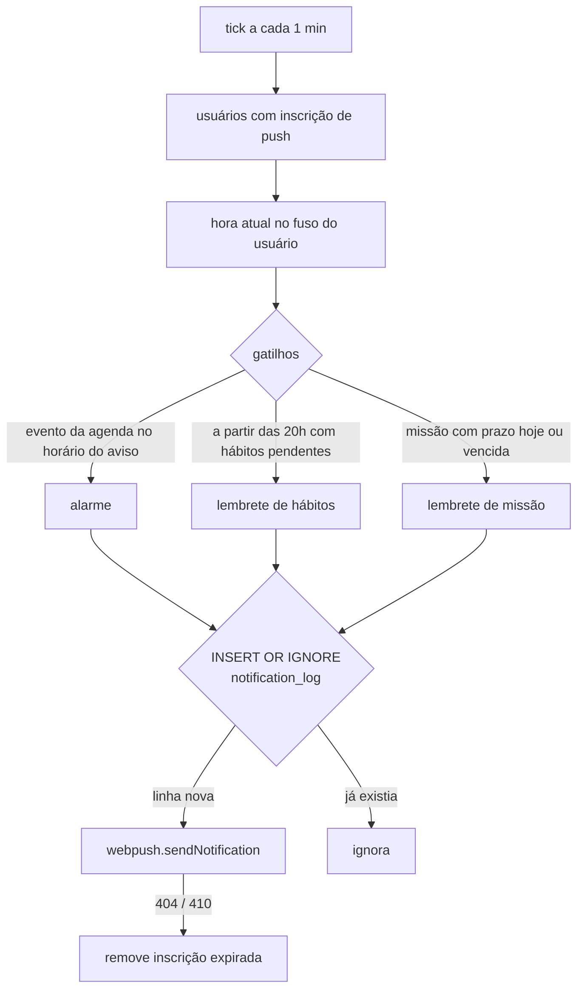

# Notificações push

As notificações chegam mesmo com o app fechado. Elas são geradas no servidor e entregues pelo serviço de push do navegador ao service worker.

## Inscrição

1. Na tela de configurações, o usuário ativa as notificações.
2. O front-end busca a chave pública em `GET /api/push/vapid-public-key`, chama `pushManager.subscribe` e envia a inscrição para `POST /api/push/subscribe`.
3. A inscrição fica em `push_subscriptions`, ligada à conta. O mesmo usuário pode ter várias (celular, computador).

## Agendador

`backend/src/reminderScheduler.js` roda a cada 60 segundos:

- **Fuso horário:** cada conta tem `settings.timezone`; datas e horários são calculados com `Intl.DateTimeFormat`, independentemente do fuso do servidor.
- **Anti-spam:** a chave primária `(user_id, kind, item_key, day)` de `notification_log` faz com que cada gatilho gere no máximo um envio por dia. Como fica no banco, isso continua valendo depois de um restart.
- **Janela de tempo:** o agendador compara "já passou do horário do aviso hoje" em vez do minuto exato, para não perder um aviso se um tick atrasar.
- **Preferências:** `notifHabits` e `notifGoals` nas configurações desligam os respectivos lembretes.

## Service worker

`src/sw.js` é escrito à mão (modo `injectManifest` do `vite-plugin-pwa`):

- `push`: mostra a notificação com ícone e badge do app; alarmes usam `requireInteraction` e vibração.
- `notificationclick`: foca uma janela já aberta do app ou abre uma nova.
- `skipWaiting()` + `clients.claim()`: uma versão nova do service worker assume na hora, sem esperar todas as abas fecharem. Sem isso, um PWA instalado que fica em segundo plano nunca receberia atualizações.
